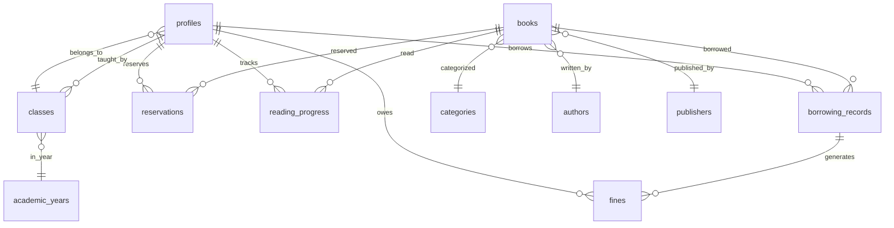

# 🕌 IDARAH WALI UL ASER Islamic Library Database Implementation Guide

## 📋 Overview

This guide provides comprehensive documentation for implementing a clean, secure database specifically designed for the IDARAH WALI UL ASER Islamic library management system. The database has been architected to handle the unique requirements of an Islamic educational institution with proper Arabic/English support, role-based access control, and comprehensive library management features.

## 🎯 Database Architecture

### Core Design Principles
- **Islamic-Centric**: Designed specifically for Islamic educational institutions
- **Multilingual Support**: Full Arabic, English, Urdu, Persian, and Turkish support
- **Role-Based Security**: Admin, Teacher, and Student access levels
- **Comprehensive Audit Trail**: Track all library operations
- **Scalable Design**: Built to grow with your institution

### Database Schema Overview



## 🗄️ Table Structure

### 1. User Management Tables

#### `profiles`
Central user table with Islamic-specific fields:
- **Core Fields**: id, email, full_name, name_arabic, role
- **Student Fields**: guardian_name, student_id, class_id, enrollment_date
- **Library Fields**: max_borrow_limit, current_borrowed_count, bookmarks
- **Preferences**: preferred_language, avatar_url

#### `classes`
Academic class management:
- **Basic Info**: name, name_arabic, description, grade_level
- **Management**: teacher_id, academic_year, max_students
- **Status**: is_active

### 2. Library Content Tables

#### `books`
Comprehensive book management with Islamic categorization:
- **Identification**: title, title_arabic, isbn, author_name, author_arabic
- **Classification**: category, subcategory, language, tags
- **Physical Management**: physical_copies, available_copies, location_shelf
- **Digital Resources**: file_url, file_type, cover_image_url
- **Engagement**: download_count, borrow_count, rating

#### `categories`
Islamic book classification system:
- **Predefined Categories**: Quran, Hadith, Fiqh, Tafsir, Seerah, Aqeedah
- **Multilingual**: name, name_arabic, description, description_arabic
- **Hierarchical**: parent_id for subcategories

#### `authors`
Islamic scholars and authors:
- **Identity**: name, name_arabic, biography, biography_arabic
- **Academic**: specialization, birth_year, death_year, nationality
- **Verification**: is_verified flag for authenticated scholars

#### `publishers`
Publishing house information:
- **Identity**: name, name_arabic, country, city
- **Contact**: website, email, phone
- **Status**: is_active

### 3. Library Operations Tables

#### `borrowing_records`
Complete borrowing lifecycle management:
- **Core**: user_id, book_id, borrowed_date, due_date, status
- **Management**: issued_by, returned_to, renewal_count, max_renewals
- **Condition**: condition_on_borrow, condition_on_return, notes
- **Fines**: fine_amount, fine_paid

#### `fines`
Detailed fine management:
- **Core**: user_id, amount, reason, description, status
- **Payment**: paid_amount, paid_date, payment_method
- **Management**: issued_by, waived_by, waived_reason

#### `reservations`
Book reservation system:
- **Core**: user_id, book_id, reserved_date, expires_date, status
- **Priority**: priority_order for queue management
- **Notifications**: notification_sent, notification_date

#### `reading_progress`
Student reading tracking:
- **Progress**: current_page, progress_percentage, is_completed
- **Engagement**: reading_time_minutes, session_count, user_rating
- **Notes**: bookmarked_pages, highlighted_text, user_review

## 🔐 Security Model

### Row Level Security (RLS) Implementation

#### Admin Access
- **Full Access**: All tables with complete CRUD operations
- **User Management**: Create, update, delete user profiles
- **System Configuration**: Manage categories, academic years
- **Financial**: Waive fines, manage payment records

#### Teacher Access
- **Student Management**: View and manage student profiles in their classes
- **Library Operations**: Issue and return books, manage borrowing records
- **Content Management**: Add and update books, authors, publishers
- **Academic Tracking**: View student reading progress

#### Student Access
- **Personal Data**: View and update own profile information
- **Library Usage**: View own borrowing history, fines, reservations
- **Reading**: Track personal reading progress, bookmarks, notes
- **Reservations**: Create and manage own book reservations

### Authentication Functions

```sql
-- Check user roles
is_admin(user_id) -> BOOLEAN
is_teacher(user_id) -> BOOLEAN  
is_teacher_or_admin(user_id) -> BOOLEAN

-- Get user role from JWT
auth.user_role() -> TEXT
```

## 🚀 Implementation Steps

### Step 1: Create New Supabase Project
1. Go to [Supabase Dashboard](https://supabase.com/dashboard)
2. Create a new project specifically for the Islamic library
3. Wait for project initialization to complete

### Step 2: Execute Database Schema
1. Open the SQL Editor in your new Supabase project
2. Copy the entire content from `islamic-library-database-schema.sql`
3. Execute the script (this will take a few minutes)
4. Verify all tables and functions are created successfully

### Step 3: Set Up Admin User
1. Create admin user through Supabase Auth:
   ```sql
   -- After user signs up with admin@idarah.com
   SELECT setup_admin_user('admin@idarah.com');
   ```

### Step 4: Configure Environment Variables
Update your `.env.local` file:
```env
VITE_SUPABASE_URL=https://your-new-project-id.supabase.co
VITE_SUPABASE_ANON_KEY=your-new-anon-key
```

### Step 5: Update Frontend Configuration
Update `src/lib/supabase.ts` with new project credentials.

## 📊 Key Features

### Islamic Book Categories
- **Quran** (القرآن الكريم): Holy Quran and related studies
- **Hadith** (الحديث الشريف): Prophetic traditions
- **Fiqh** (الفقه): Islamic jurisprudence
- **Tafsir** (التفسير): Quranic commentary
- **Aqeedah** (العقيدة): Islamic creed and theology
- **Seerah** (السيرة النبوية): Prophetic biography
- **History** (التاريخ الإسلامي): Islamic history
- **Ethics** (الأخلاق الإسلامية): Islamic morals and character

### Multilingual Support
- **Arabic** (ar): Primary language for Islamic texts
- **English** (en): International language support
- **Urdu** (ur): Regional language support
- **Persian** (fa): Classical Islamic language
- **Turkish** (tr): Ottoman and modern Turkish texts

### Library Management Features
- **Borrowing System**: Complete lifecycle from issue to return
- **Fine Management**: Automatic calculation and tracking
- **Reservation Queue**: Priority-based book reservations
- **Reading Progress**: Individual student tracking
- **Digital Resources**: PDF, EPUB, audio, video support
- **Physical Inventory**: Shelf location and copy management

## 🔧 Utility Functions

### Library Operations
```sql
-- Check book availability
is_book_available(book_uuid) -> BOOLEAN

-- Get user borrowing summary
get_user_borrowing_summary(user_uuid) -> TABLE

-- Renew book borrowing
renew_book_borrowing(borrowing_uuid, days_extension) -> BOOLEAN

-- Return book
return_book(borrowing_uuid, returned_to_user, condition) -> BOOLEAN
```

### Maintenance Functions
```sql
-- Calculate overdue fines
calculate_overdue_fines() -> void

-- Daily maintenance tasks
daily_maintenance() -> void
```

## 📈 Dashboard Statistics

The `dashboard_stats` view provides real-time statistics:
- Total books available
- Active students and teachers
- Current borrowings and overdue books
- Pending fines and reservations

## 🔄 Maintenance and Monitoring

### Daily Tasks
- Run `daily_maintenance()` function
- Monitor overdue books and fines
- Check reservation queue
- Update book availability

### Weekly Tasks
- Review user activity
- Update book ratings and statistics
- Clean up expired reservations
- Generate library reports

### Monthly Tasks
- Backup database
- Review and update categories
- Analyze reading patterns
- Update academic year data

## 🤝 Support and Troubleshooting

### Common Issues
1. **RLS Policy Errors**: Ensure user roles are properly set in auth metadata
2. **Foreign Key Violations**: Check data integrity before bulk operations
3. **Performance Issues**: Monitor index usage and query performance

### Best Practices
- Always use the provided utility functions for library operations
- Maintain data consistency through proper transaction handling
- Regular backups and monitoring
- Keep audit trails for all administrative actions

---

**May Allah bless this Islamic educational endeavor and make it beneficial for the Muslim community! 🤲**
